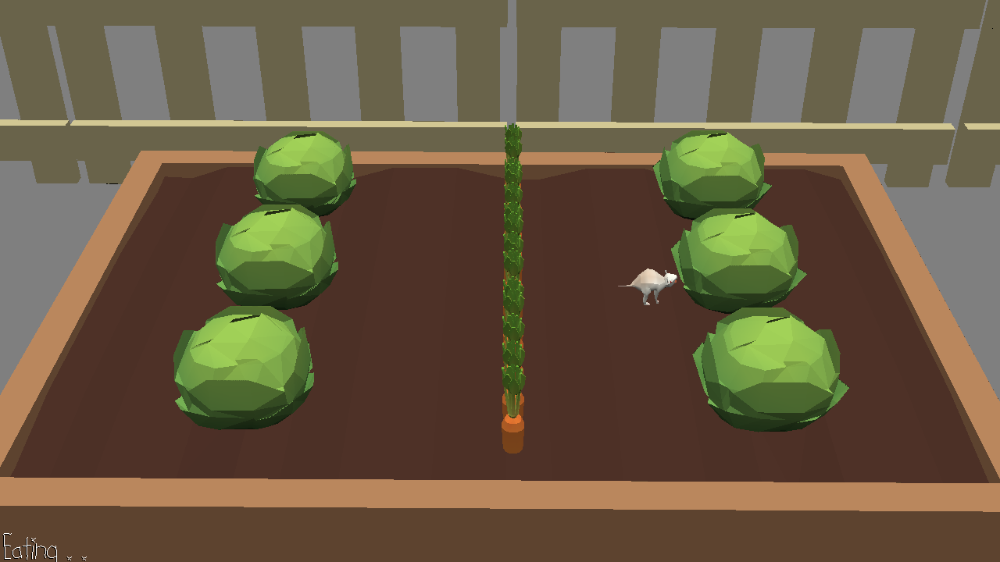

# One two three, let's eat

Author: Zi Wang

Design: You have to listen carefully about the footsteps to determine if you should eat the food or hide in the dirt.

Screen Shot:

How To Play:

Use WASD to control the mouse, and press space to eat, return to hide in the dirt.

Sources: 

"Footsteps_Walking Boot_Mud and Twigs.wav" by omnisounddesign of Freesound.org
"Chewing, Carrot, A.wav" by InspectorJ (www.jshaw.co.uk) of Freesound.org

This game was built with [NEST](NEST.md).

